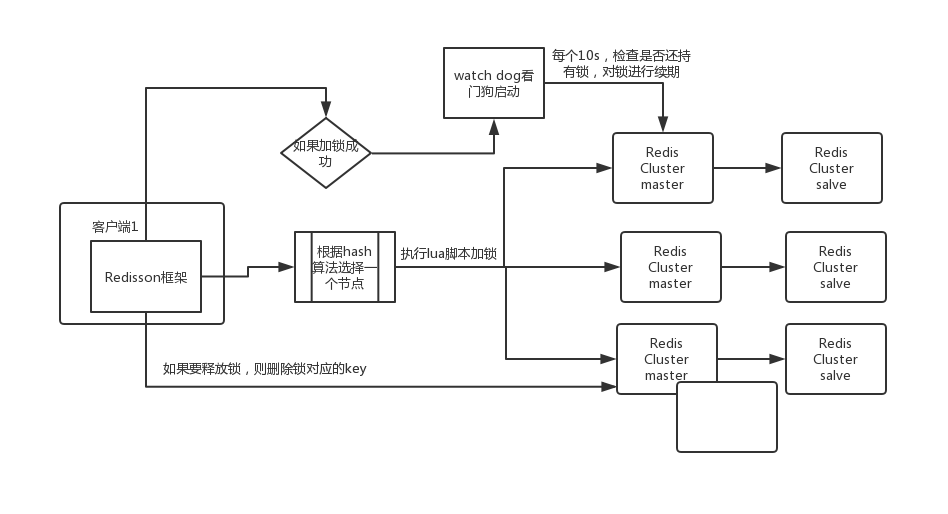
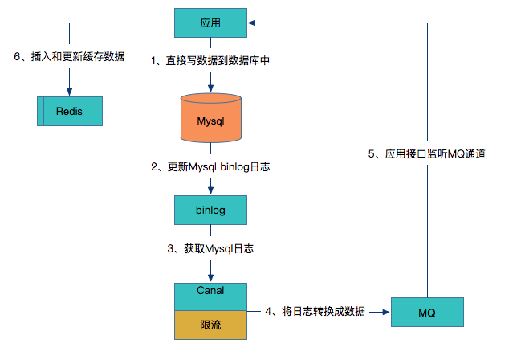

# Redis Summary

------

- Redis是速度非常快的非关系型内存键值数据库，可以存储键跟五中不同类型的值之间的映射。
- 键的类型只能为字符串，值支持五种数据类型：字符串、列表、哈希、集合、有序集合。
- Redis 支持很多特性，例如将内存中的数据持久化到硬盘中，使用复制来扩展读性能，使用分片来扩展写性能。

## 一、Redis基本数据类型

数据类型|可以存储的值|操作|
:----:|:----:|:----|
String | 字符串、整数、浮点数 |  ①、对整个字符串或者字符串的一部分执行操作 <br/> ②、对整数和浮点数执行自增或者自减操作
List | 列表 | ①、从两端压入或者弹出元素 <br/> ②、对单个或者多个元素进行修剪，只保留某个范围的元素
Set | 无序集合 | ①、添加、获取、移除单个元素 <br/> ②、检查一个元素是否存在于集合中 <br/> ③、计算交集、并集、差集 <br/>  ④、从集合里随机获取元素
Hash | 包含键值对的无序散列表 | ①、添加、获取、移除单个键值对、获取所有键值对 <br/> ②、检查某个键是否存在
ZSet | 有序集合 | ①、添加、获取、删除元素 <br/> ②、根据分值范围或者成员来获取元素 <br/> ③、计算一个键的排名

### 1、String
```
常用命令： set, get, decr, incr, mget, setnx
```
- String数据结构是简单的key-value类型，value其实不仅可以是String，也可以是数字。<br/> 
- **常规key-value缓存应用； 常规计数：微博数，粉丝数等。**

### 2、List
```
常用命令: lpush, rpush, lpop, rpop, lrange, blpop
```

- List 就是链表，Redis list的应用场景非常多，也是Redis最重要的数据结构之一，比如**微博的关注列表，粉丝列表，消息列表**等功能都可以用Redis的 list 结构来实现。

- **Redis list 的实现为一个双向链表，可以通过rpush生产消息，lpop消费消息，实现一个消息队列。**

- 另外可以通过 lrange 命令，就是从某个元素开始读取多少个元素，可以**基于list实现分页查询**，这个很棒的一个功能，基于 redis 实现简单的高性能分页，可以做类似微博那种下拉不断分页的东西（一页一页的往下走），性能高。

### 3、Set
```
常用命令： sadd,spop,smembers,sunion 等
```
- set 对外提供的功能与list类似是一个列表的功能，特殊之处在于 **set 是可以自动排重**的。

- 当你需要存储一个列表数据，又不希望出现重复数据时，set是一个很好的选择，并且set提供了**判断某个成员是否在一个set集合内**的重要接口，这个也是list所不能提供的。可以**基于 set 轻易实现交集、并集、差集**的操作。

- 比如：在微博应用中，可以将一个用户所有的关注人存在一个集合中，将其所有粉丝存在一个集合。Redis可以非常方便的**实现如共同关注、共同粉丝、共同喜好**等功能。这个过程也就是求交集的过程，具体命令如下：
```
sinterstore key1 key2 key3     将交集存在key1内
```

### 4、Hash 

```
常用命令： hget,hset,hgetall 等。

```
- Hash 是一个 string 类型的 field 和 value 的映射表，**hash 特别适合用于存储对象**，后续操作的时候，你可以直接仅仅修改这个对象中的某个字段的值。 比如我们可以Hash数据结构来存储用户信息，商品信息等等。比如下面我就用 hash 类型存放了我本人的一些信息：
```
key=user9527
value={
  “id”: 1,
  “name”: “Test”,
  “age”: 20,
  “location”: “上海”
}
```

### 5、Sorted Set
```
常用命令： zadd,zrange,zrem,zcard,zrangebyscore等

```
- 和set相比，sorted set增加了一个权重参数score，使得集合中的元素能够按score进行有序排列。

- 举例： 在直播系统中，**实时排行信息包含直播间在线用户列表，各种礼物排行榜，弹幕消息（可以理解为按消息维度的消息排行榜）等信息**，适合使用 Redis 中的 SortedSet 结构进行存储。

## 二、Redis的使用场景
### 计数器
可以对 String 进行自增自减运算，从而实现计数器功能。

Redis 这种内存型数据库的读写性能非常高，很适合存储频繁读写的计数量。

### 缓存
将热点数据放到内存中，设置内存的最大使用量以及淘汰策略来保证缓存的命中率。

### 消息队列
List 是一个双向链表，可以通过 lpop 和 rpush 写入和读取消息。(blpop可阻塞等待消息)

不过最好使用 Kafka、RabbitMQ 等消息中间件。
### 会话缓存
可以使用 Redis 来统一存储多台应用服务器的会话信息。

当应用服务器不再存储用户的会话信息，也就不再具有状态，一个用户可以请求任意一个应用服务器，从而更容易实现高可用性以及可伸缩性。

### 分布式锁
#### 1、分布式锁具备条件:
> * 分布式环境下，同一段代码块同一时间只能被一个机器的一个线程执行
> * 高可用、高性能锁的获取与释放
> * 具备可重入特性
> * 具备锁的失效机制，防止死锁
> * 具备非阻塞锁的特征，即没有获取到锁直接返回锁失败

#### 2、Redisson实现Redis分布式锁原理：
##### 1、加锁机制
现在某个客户端要加锁。如果该客户端面对的是一个redis cluster集群，他首先会根据hash节点选择一台机器。这里注意，仅仅只是选择一台机器！这点很关键！紧接着，就会发送一段lua脚本到redis上，lua脚本如下所示：
```
/**
 * KEYS[1] :代表要加锁的key
 * ARGV[1] :代表锁key的默认生存时间，默认30s
 * ARGV[2] :客户端ID + 加锁线程随机UUID（任意不重复字符串）
 */
if(redis.call('exist',KEYS[1]) == 0) then
    redis.call('hset', KEYS[1], ARGV[2], 1);
    resid.call('pexpire' , KEYS[1], ARGV[1]);
    return nil;
end;
if(redis.call('hexists', KEYS[1], AGRV[2]) == 1) then
    redis.call('hincrby', KEYS[1] , ARGV[2] ,1);
    redis.call('pexpire' , KEYS[1] , ARGV[1]);
    return nil;
end;
return redis.call('pttl', KE);
```
> * 为啥要用lua脚本呢？
**因为一个复杂的业务逻辑，可以通过封装在lua脚本中发送给redis，保证这段复杂业务逻辑`执行的原子性`。**
> * lua脚本解释：<br/>
①、第一个if，判断要加锁的key是否已存在，不存在的话，使用hset命令先创建一个名为key的hash对象，并把`AGRV[2]`作为hash的key，value为1，之后设置过期时间返回`（直接加锁成功的逻辑）`。<br/>
②、第二个if，运行到第二个if，说明要加锁的key对应的hash对象在缓存中已经存在了。所以直接判断在hash对象中key为`AGRV[2]`的键值对是否存在，如果存在，表示key对应的锁在当前客户端线程中已添加，只需将value自增1即可，之后重新设置过期时间后返回`（锁重入成功）`。<br/>
③、如果上面两个if逻辑都未进入，则直接返回该锁的剩余生存时间 `(锁互斥加锁失败)`<br/>
> * example：执行伪代码 ```redis.getLock("test_distribute_lock")``` , redis中对应数据为:
```
test_distribute_lock:{

    "1:8743c9c0-0795-4907-87fd-6c719a6b4586":1
    
}
```


##### 2、锁互斥机制
见lua脚本解释③

##### 3、watch dog 自动续期机制
客户端1加锁的锁key默认生存时间才30秒，如果超过了30秒，客户端1还想一直持有这把锁，怎么办呢？只要客户端1一旦加锁成功，就会启动一个watch dog看门狗，**他是一个后台线程，会每隔10秒检查一下，如果客户端1还持有锁key，那么就会不断的延长锁key的生存时间**。

##### 4、可重入加锁机制
那如果客户端1都已经持有了这把锁了，结果可重入的加锁会怎么样呢？比如下面这种代码：
```
RedisLock lock = redis.getLock("test_distribute_lock");
lock.lock();
/**一大段业务逻辑**/

lock.lock();
/**一大段业务逻辑**/

lock.unlock();
lock.unlock();
```
> * 按照上面对加锁lua脚本解释，第一个lock执行第一个if逻辑 。第二个lock执行第二个if逻辑
> * 重入加锁后，example中的hash数据变为下面这样，由此可见，`hash中的value为锁的加锁次数`：
```JSON
test_distribute_lock:{

    "1:8743c9c0-0795-4907-87fd-6c719a6b4586":2
    
}
```
##### 5、锁释放机制
如果执行lock.unlock()，就可以释放分布式锁，此时的业务逻辑也是非常简单的。就是每次都对test_distribute_lock数据结构中的那个加锁次数减1。如果发现加锁次数是0了，说明这个客户端已经不再持有锁了，此时就会用：“del test_distribute_lock”命令，从redis里删除这个key。另外的客户端2就可以尝试完成加锁了。这就是所谓的分布式锁的开源Redisson框架的实现机制。

##### 6、上述Redis分布式锁的缺点

其实上面那种方案最大的问题，就是如果你对某个redis master实例，写入了myLock这种锁key的value，此时会异步复制给对应的master slave实例。但是这个过程中一旦发生redis master宕机，主备切换，redis slave变为了redis master。<br/>

接着就会导致，客户端2来尝试加锁的时候，在新的redis master上完成了加锁，而客户端1也以为自己成功加了锁。此时就会导致多个客户端对一个分布式锁完成了加锁。这时系统在业务上一定会出现问题，导致各种脏数据的产生。<br/>

所以这个就是redis cluster，或者是redis master-slave架构的主从异步复制导致的redis分布式锁的最大缺陷：**在redis master实例宕机的时候，可能导致多个客户端同时完成加锁。** <br/>



## 二、Redis与Memecache的异同

### 数据类型
**Redis支持更丰富的数据类型（支持更复杂的应用场景）**：Redis不仅仅支持简单的k/v类型的数据，同时还提供list，set，zset，hash等数据结构的存储。memcache支持简单的数据类型，String。

### 数据持久化
Redis支持数据的持久化，可以将内存中的数据保持在磁盘中，重启的时候可以再次加载进行使用,而Memecache把数据全部存在内存之中。

### 分布式
Memcached 不支持分布式，只能通过在客户端使用一致性哈希来实现分布式存储，这种方式在存储和查询时都需要先在客户端计算一次数据所在的节点。<br/>

Redis Cluster 实现了分布式的支持。<br/>

### 内存管理机制
> * 在 Redis 中，并不是所有数据都一直存储在内存中，可以将一些很久没用的 value 交换到磁盘，而 Memcached 的数据则会一直在内存中。

> * Memcached 将内存分割成特定长度的块来存储数据，以完全解决内存碎片的问题。但是这种方式会使得内存的利用率不高，例如块的大小为 128 bytes，只存储 100 bytes 的数据，那么剩下的 28 bytes 就浪费掉了。

网络上一张对比图： <br/>


## 三、Redis过期机制
Redis中有个设置时间过期的功能，即对存储在 redis 数据库中的值可以设置一个过期时间。作为一个缓存数据库，这是非常实用的。如我们一般项目中的 token 或者一些登录信息，尤其是短信验证码都是有时间限制的，按照传统的数据库处理方式，一般都是自己判断过期，这样无疑会严重影响项目性能。<br/>

我们 set key 的时候，都可以给一个 expire time，就是过期时间，通过过期时间我们可以指定这个 key 可以存活的时间。<br/>

如果假设你设置了一批 key 只能存活1个小时，那么接下来1小时后，redis是怎么对这批key进行删除的？<br/>

### 定期删除+惰性删除

**定期删除**：redis默认是每隔 100ms 就随机抽取一些设置了过期时间的key，检查其是否过期，如果过期就删除。注意这里是随机抽取的。为什么要随机呢？你想一想假如 redis 存了几十万个 key ，每隔100ms就遍历所有的设置过期时间的 key 的话，就会给 CPU 带来很大的负载！<br/>
**惰性删除** ：定期删除可能会导致很多过期 key 到了时间并没有被删除掉。所以就有了惰性删除。假如你的过期 key，靠定期删除没有被删除掉，还停留在内存里，除非你的系统去查一下那个 key，才会被redis给删除掉。这就是所谓的惰性删除！<br/>

但是仅仅通过设置过期时间还是有问题的。如果定期删除漏掉了很多过期 key，然后也没及时去查，也就没走惰性删除，此时会怎么样？如果大量过期key堆积在内存里，导致redis内存块耗尽了。怎么解决这个问题呢？<br/>

### Redis 内存淘汰机制

Redis 提供 6种数据淘汰策略：<br/>

 > 1. volatile-lru：从已设置过期时间的数据集（server.db[i].expires）中挑选最近最少使用的数据淘汰。
 > 2. volatile-ttl：从已设置过期时间的数据集（server.db[i].expires）中挑选将要过期的数据淘汰。
 > 3. volatile-random：从已设置过期时间的数据集（server.db[i].expires）中任意选择数据淘汰。
 > 4. allkeys-lru：当内存不足以容纳新写入数据时，在键空间中，移除最近最少使用的key（这个是最常用的）。
 > 5. allkeys-random：从数据集（server.db[i].dict）中任意选择数据淘汰。
 > 6. no-eviction：禁止驱逐数据，也就是说当内存不足以容纳新写入数据时，新写入操作会报错。这个应该没人使用吧！
 
## 四、Redis持久化
Redis 是内存型数据库，为了保证数据在断电后不会丢失，需要将内存中的数据持久化到硬盘上。
Redis的一种持久化方式叫**快照（snapshotting，RDB）**,另一种方式是**只追加文件（append-only file,AOF）**.这两种方法各有千秋，下面会详细这两种持久化方法是什么，怎么用，如何选择适合的持久化方法。<br/>

### RDB 持久化
Redis可以通过创建快照来获得存储在内存里面的数据在某个时间点上的副本。Redis创建快照之后，可以对快照进行备份，可以将快照复制到其他服务器从而创建具有相同数据的服务器副本（Redis主从结构，主要用来提高Redis性能），还可以将快照留在原地以便重启服务器的时候使用。<br/>

快照持久化是Redis默认采用的持久化方式，在redis.conf配置文件中默认有此下配置：<br/>
```
save 900 1          #在900秒(15分钟)之后，如果至少有1个key发生变化，Redis就会自动触发BGSAVE命令创建快照。

save 300 10         #在300秒(5分钟)之后，如果至少有10个key发生变化，Redis就会自动触发BGSAVE命令创建快照。

save 60 10000       #在60秒(1分钟)之后，如果至少有10000个key发生变化，Redis就会自动触发BGSAVE命令创建快照。
```
创建快照的办法有如下几种：
> * BGSAVE命令： 客户端向Redis发送 BGSAVE命令 来创建一个快照。对于支持BGSAVE命令的平台来说（基本上所有平台支持，除了Windows平台），Redis会调用fork来创建一个子进程，然后子进程负责将快照写入硬盘，而父进程则继续处理命令请求。
> * SAVE命令： 客户端还可以向Redis发送 SAVE命令 来创建一个快照，接到SAVE命令的Redis服务器在快照创建完毕之前不会再响应任何其他命令。SAVE命令不常用，我们通常只会在没有足够内存去执行BGSAVE命令的情况下，又或者即使等待持久化操作执行完毕也无所谓的情况下，才会使用这个命令。
> * save选项： 如果用户设置了save选项（一般会默认设置），比如 save 60 10000，那么从Redis最近一次创建快照之后开始算起，当“60秒之内有10000次写入”这个条件被满足时，Redis就会自动触发BGSAVE命令。
> * SHUTDOWN命令： 当Redis通过SHUTDOWN命令接收到关闭服务器的请求时，或者接收到标准TERM信号时，会执行一个SAVE命令，阻塞所有客户端，不再执行客户端发送的任何命令，并在SAVE命令执行完毕之后关闭服务器。
> * 一个Redis服务器连接到另一个Redis服务器： 当一个Redis服务器连接到另一个Redis服务器，并向对方发送SYNC命令来开始一次复制操作的时候，如果主服务器目前没有执行BGSAVE操作，或者主服务器并非刚刚执行完BGSAVE操作，那么主服务器就会执行BGSAVE命令

**最后，如果数据量很大，保存快照的时间会很长。**<br/>

### AOF  持久化
与快照持久化相比，AOF持久化 的实时性更好，因此已成为主流的持久化方案。默认情况下Redis没有开启AOF（append only file）方式的持久化，可以通过appendonly参数开启：<br/>
```
appendonly yes
```
开启AOF持久化后每执行一条会更改Redis中的数据的命令，Redis就会将该命令写入硬盘中的AOF文件。AOF文件的保存位置和RDB文件的位置相同，都是通过dir参数设置的，默认的文件名是appendonly.aof。
在Redis的配置文件中存在三种不同的 AOF 持久化方式，它们分别是：<br/>
```
appendfsync always     #每次有数据修改发生时都会写入AOF文件,这样会严重降低Redis的速度
appendfsync everysec   #每秒钟同步一次，显式地将多个写命令同步到硬盘
appendfsync no         #让操作系统决定何时进行同步
```
`appendfsync always` 可以实现将数据丢失减到最少，不过这种方式需要对硬盘进行大量的写入而且每次只写入一个命令，十分影响Redis的速度。另外使用固态硬盘的用户谨慎使用appendfsync always选项，因为这会明显降低固态硬盘的使用寿命。<br/>


为了兼顾数据和写入性能，用户可以考虑 `appendfsync everysec`选项 ，让Redis每秒同步一次AOF文件，Redis性能几乎没受到任何影响。而且这样即使出现系统崩溃，用户最多只会丢失一秒之内产生的数据。当硬盘忙于执行写入操作的时候，Redis还会优雅的放慢自己的速度以便适应硬盘的最大写入速度。<br/>


`appendfsync no` 选项一般不推荐，这种方案会使Redis丢失不定量的数据而且如果用户的硬盘处理写入操作的速度不够的话，那么当缓冲区被等待写入的数据填满时，Redis的写入操作将被阻塞，这会导致Redis的请求速度变慢。<br/>

**虽然AOF持久化非常灵活地提供了多种不同的选项来满足不同应用程序对数据安全的不同要求，但AOF持久化也有缺陷——AOF文件的体积太大。** <br/>

**为了解决AOF体积过大的问题，用户可以向Redis发送 `BGREWRITEAOF`命令 ，这个命令会通过移除AOF文件中的冗余命令来重写（rewrite）AOF文件来减小AOF文件的体积** 。BGREWRITEAOF命令和BGSAVE创建快照原理十分相似，所以AOF文件重写也需要用到子进程，这样会导致性能问题和内存占用问题，和快照持久化一样。更糟糕的是，如果不加以控制的话，AOF文件的体积可能会比快照文件大好几倍。


### Redis 4.0 对于持久化机制的优化

Redis 4.0 开始支持 RDB 和 AOF 的混合持久化（默认关闭，可以通过配置项 aof-use-rdb-preamble 开启）。

如果把混合持久化打开，AOF 重写的时候就直接把 RDB 的内容写到 AOF 文件开头。这样做的好处是可以结合 RDB 和 AOF 的优点, 快速加载同时避免丢失过多的数据。当然缺点也是有的， AOF 里面的 RDB 部分是压缩格式不再是 AOF 格式，可读性较差。

### 补充内容：AOF 重写
AOF重写可以产生一个新的AOF文件，这个新的AOF文件和原有的AOF文件所保存的数据库状态一样，但体积更小。

AOF重写是一个有歧义的名字，该功能是通过读取数据库中的键值对来实现的，程序无须对现有AOF文件进行任伺读入、分析或者写入操作。

在执行 BGREWRITEAOF 命令时，Redis 服务器会维护一个 AOF 重写缓冲区，该缓冲区会在子进程创建新AOF文件期间，记录服务器执行的所有写命令。当子进程完成创建新AOF文件的工作之后，服务器会将重写缓冲区中的所有内容追加到新AOF文件的末尾，使得新旧两个AOF文件所保存的数据库状态一致。最后，服务器用新的AOF文件替换旧的AOF文件，以此来完成AOF文件重写操作

## 五、Redis事物
Redis 通过 `MULTI、EXEC、WATCH` 等命令来实现事务(transaction)功能。事务提供了一种将多个命令请求打包，然后一次性、按顺序地执行多个命令的机制，并且在事务执行期间，服务器不会中断事务而改去执行其他客户端的命令请求，它会将事务中的所有命令都执行完毕，然后才去处理其他客户端的命令请求。

在传统的关系式数据库中，常常用 ACID 性质来检验事务功能的可靠性和安全性。在 Redis 中，事务总是具有原子性（Atomicity)、一致性(Consistency)和隔离性（Isolation），并且当 Redis 运行在某种特定的持久化模式下时，事务也具有持久性（Durability）。

## 六、Redis 主从复制

### 主从复制概述：
主从复制，是指将一台Redis服务器的数据，复制到其他的Redis服务器。前者称为主节点(master)，后者称为从节点(slave)；数据的复制是单向的，只能由主节点到从节点。<br/>

默认情况下，每台Redis服务器都是主节点；且一个主节点可以有多个从节点(或没有从节点)，但一个从节点只能有一个主节点。 <br/>


主从复制的作用主要包括：

> * 数据冗余：主从复制实现了数据的热备份，是持久化之外的一种数据冗余方式。
> * 故障恢复：当主节点出现问题时，可以由从节点提供服务，实现快速的故障恢复；实际上是一种服务的冗余。
> * 负载均衡：在主从复制的基础上，配合读写分离，可以由主节点提供写服务，由从节点提供读服务（即写Redis数据时应用连接主节点，读Redis数据时应用连接从节点），分担服务器负载；尤其是在写少读多的场景下，通过多个从节点分担读负载，可以大大提高Redis服务器的并发量。
> * 高可用基石：除了上述作用以外，主从复制还是哨兵和集群能够实施的基础，因此说主从复制是Redis高可用的基础。

### 连接过程

 1. 主服务器创建快照文件，发送给从服务器，并在发送期间使用缓冲区记录执行的写命令。快照文件发送完毕之后，开始向从服务器发送存储在缓冲区中的写命令；
 2. 从服务器丢弃所有旧数据，载入主服务器发来的快照文件，之后从服务器开始接受主服务器发来的写命令；
 3. 主服务器每执行一次写命令，就向从服务器发送相同的写命令。

### 主从链
随着负载不断上升，主服务器可能无法很快地更新所有从服务器，或者重新连接和重新同步从服务器将导致系统超载。为了解决这个问题，可以创建一个中间层来分担主服务器的复制工作。中间层的服务器是最上层服务器的从服务器，又是最下层服务器的主服务器。


### 哨兵 Sentinel
Sentinel（哨兵）可以监听集群中的服务器，并在主服务器进入下线状态时，自动从从服务器中选举出新的主服务器。 <br/>

哨兵也是 Redis 服务器，只是它与我们平时提到的 Redis 服务器职能不同，哨兵负责监视普通的 Redis 服务器，提高一个服务器集群的健壮和可靠性。哨兵和普通的 Redis 服务器所用的是同一套服务器框架，这包括：网络框架，底层数据结构，订阅发布机制等。


·   **监控(Monitoring)**: 哨兵(sentinel) 会不断地检查你的Master和Slave是否运作正常。

·   **提醒(Notification)**:当被监控的某个 Redis出现问题时, 哨兵(sentinel) 可以通过 API 向管理员或者其他应用程序发送通知。

·   **自动故障迁移(Automatic failover)**:当一个Master不能正常工作时，哨兵(sentinel) 会开始一次自动故障迁移操作,它会将失效Master的其中一个Slave升级为新的Master, 并让失效Master的其他Slave改为复制新的Master; 当客户端试图连接失效的Master时,集群也会向客户端返回新Master的地址,使得集群可以使用Master代替失效Master。<br/>

哨兵(sentinel) 是一个分布式系统,你可以在一个架构中运行多个哨兵(sentinel) 进程,这些进程使用流言协议(gossipprotocols)来接收关于Master是否下线的信息,并使用投票协议(agreement protocols)来决定是否执行自动故障迁移,以及选择哪个Slave作为新的Master.<br/>

**每个哨兵(sentinel) 会向其它哨兵(sentinel)、master、slave定时发送消息,以确认对方是否”活”着,如果发现对方在指定时间(可配置)内未回应,则暂时认为对方已挂(所谓的”主观认为宕机” Subjective Down,简称sdown).**<br/>

**若“哨兵群”中的多数sentinel,都报告某一master没响应,系统才认为该master"彻底死亡"(即:客观上的真正down机,Objective Down,简称odown),通过一定的vote算法,从剩下的slave节点中,选一台提升为master,然后自动修改相关配置.** <br/>


### Redis 分片

分片是将数据划分为多个部分的方法，可以将数据存储到多台机器里面，这种方法在解决某些问题时可以获得线性级别的性能提升。<br/>

假设有 4 个 Reids 实例 R0，R1，R2，R3，还有很多表示用户的键 user:1，user:2，... ，有不同的方式来选择一个指定的键存储在哪个实例中。

> * 最简单的方式是范围分片，例如用户 id 从 0~1000 的存储到实例 R0 中，用户 id 从 1001~2000 的存储到实例 R1 中，等等。但是这样需要维护一张映射范围表，维护操作代价很高。
> * 还有一种方式是哈希分片，使用 CRC32 哈希函数将键转换为一个数字，再对实例数量求模就能知道应该存储的实例。

根据执行分片的位置，可以分为三种分片方式：
> * 客户端分片：客户端使用一致性哈希等算法决定键应当分布到哪个节点。
> * 代理分片：将客户端请求发送到代理上，由代理转发请求到正确的节点上。
> * 服务器分片：Redis Cluster。

Redis集群实现方案： 
> 1、Twitter开发的twemproxy

> 2、豌豆荚开发的codis

> 3、redis官方的redis-cluster

1、twemproxy架构简单 就是用proxy对后端redis server进行代理 但是由于代理层的消耗性能很低 而且通常涉及多个key的操作都是不支持的 而且本身不支持动态扩容和透明的数据迁移 而且也失去维护 Twitter内部已经不使用了。<br/>

2、redis-cluster是三个里性能最强大的，因为他使用去中心化的思想，使用hash slot方式，将16348个hash slot 覆盖到所有节点上，对于存储的每个key值，使用`CRC16(KEY)&16348=slot` 得到他对应的hash slot, 并在访问key时就去找他的hash slot在哪一个节点上,然后由当前访问节点从实际被分配了这个hash slot的节点去取数据，节点之间使用轻量协议通信，减少带宽占用，性能很高，自动实现负载均衡与高可用， 自动实现failover， 并且支持动态扩展。官方已经玩到可以1000个节点 实现的复杂度低， 总之个人比较喜欢这个架构 因为他的去中心化思想免去了proxy的消耗，是全新的思路。<br/>

但是它也有一些不足，例如官方没有提供图形化管理工具，运维体验差， 全手工数据迁移 并且自己对自己本身的redis命令支持也不完全等。 但是这些问题不能掩盖他关键的新思想所带来的的优势， 随着官方的推进，这些问题应该都能在一定时间内得到解决， 那么这时候去中心化思想带来的高性能就会表现出他巨大的优势。 <br/>

3、codis使用的也是proxy思路 但是做的比较好 是这两种之间的一个中间级 而且支持redis命令是最多的 有图形化GUI管理和监控工具，运维友好。

## 七、缓存相关问题
#### 缓存雪崩
缓存同一时间大面积的失效，所以，后面的请求都会落到数据库上，造成数据库短时间内承受大量请求而崩掉。
**解决办法：**
> * 事前：尽量保证整个 redis 集群的高可用性，发现机器宕机尽快补上。选择合适的内存淘汰策略。
> * 事中：本地ehcache缓存 + hystrix限流&降级，避免MySQL崩掉
> * 事后：利用 redis 持久化机制保存的数据尽快恢复缓存


#### 缓存穿透
一般是黑客故意去请求缓存中不存在的数据，导致所有的请求都落到数据库上，造成数据库短时间内承受大量请求而崩掉。


**解决办法：** 
> * 方案一，缓存空对象：当从 DB 查询数据为空，我们仍然将这个空结果进行缓存，具体的值需要使用特殊的标识，能和真正缓存的数据区分开。另外，需要设置较短的过期时间，一般建议不要超过 5 分钟。
> * 方案二，BloomFilter 布隆过滤器：在缓存服务的基础上，构建 BloomFilter 数据结构，在 BloomFilter 中存储对应的 KEY 是否存在，如果存在，说明该 KEY 对应的值为空。那么整个逻辑的如下：
    1、根据 KEY 查询缓存。如果存在对应的值，直接返回；如果不存在，继续向下执行。
    2、根据 KEY 查询在缓存 BloomFilter 的值。如果存在值，说明该 KEY 不存在对应的值，直接返回空；如果不存在值，继续向下执行。
    3、查询 DB 对应的值，如果存在，则更新到缓存，并返回该值。如果不存在值，更新到 缓存 BloomFilter 中，并返回空。

<br/>

#### 缓存击穿
缓存击穿，是指某个极度“热点”数据在某个时间点过期时，恰好在这个时间点对这个 KEY 有大量的并发请求过来，这些请求发现缓存过期一般都会从 DB 加载数据并回设到缓存，但是这个时候大并发的请求可能会瞬间 DB 压垮。

> * 对于一些设置了过期时间的 KEY ，如果这些 KEY 可能会在某些时间点被超高并发地访问，是一种非常“热点”的数据。这个时候，需要考虑这个个问题。
> * 缓存被“击穿”的问题，和缓存“雪崩”的区别在于，前者针对某一 KEY 缓存，后者则是很多 KEY 。
> * 缓存被“击穿”的问题，和缓存“穿透”的区别在于，这个 KEY 是真实存在对应的值的。

**有两种方案可以解决：**

> * 方案一，使用互斥锁：请求发现缓存不存在后，去查询 DB 前，使用分布式锁，保证有且只有一个线程去查询 DB ，并更新到缓存。流程如下：<br/>
1、获取分布式锁，直到成功或超时。如果超时，则抛出异常，返回。如果成功，继续向下执行。<br/>
2、再去缓存中。如果存在值，则直接返回；如果不存在，则继续往下执行。因为，获得到锁，可能已经被“那个”线程去查询过 DB ，并更新到缓存中了。<br/>
3、查询 DB ，并更新到缓存中，返回值。
> * 方案二，手动过期：缓存上从不设置过期时间，功能上将过期时间存在 KEY 对应的 VALUE 里，如果发现要过期，通过一个后台的异步线程进行缓存的构建，也就是“手动”过期。通过后台的异步线程，保证有且只有一个线程去查询 DB。

<br/>

#### 缓存和 DB 的一致性如何保证？
主要有两种情况，会导致缓存和 DB 的一致性问题：

> * 并发的场景下，导致读取老的 DB 数据，更新到缓存中。
> * 缓存和 DB 的操作，不在一个事务中，可能只有一个操作成功，而另一个操作失败，导致不一致。

当然，有一点我们要注意，缓存和 DB 的一致性，我们指的更多的是最终一致性。我们使用缓存只要是提高读操作的性能，真正在写操作的业务逻辑，还是以数据库为准。例如说，我们可能缓存用户钱包的余额在缓存中，在前端查询钱包余额时，读取缓存，在使用钱包余额时，读取数据库。

**解决方案：**
> * 1、**将缓存可能存在的并行写，实现串行写。**
> * 2、**实现数据的最终一致性。**

##### 1、先淘汰缓存，再写数据库

因为先淘汰缓存，所以数据的最终一致性是可以得到有效的保证的。为什么呢？先淘汰缓存，即使写数据库发生异常，也就是下次缓存读取时，多读取一次数据库。

但是，这种方案会存在缓存和 DB 的数据会不一致的情况（读取到老的DB数据，更新到缓存中）。
那么，我们需要解决缓存并行写，实现串行写。比较简单的方式，引入分布式锁。

> * 在写请求时，先淘汰缓存之前，获取该分布式锁。
> * 在读请求时，发现缓存不存在时，先获取分布式锁。
> * 写请求时，是否主动更新缓存，根据自己业务的需要，是否有，都没问题。


这样，缓存的并行写就成功的变成串行写了。


#### 2、先写数据库，再更新缓存
按照“先写数据库，再更新缓存”，我们要保证 DB 和缓存的操作，能够在“同一个事务”中，从而实现最终一致性。

**基于定时任务来实现**

> * 首先，写入数据库。
> * 然后，在写入数据库所在的事务中，插入一条记录到任务表。该记录会存储需要更新的缓存 KEY 和 VALUE 。
> * 【异步】最后，定时任务每秒扫描任务表，更新到缓存中，之后删除该记录。

**基于消息队列来实现**

> * 首先，写入数据库。
> * 然后，发送带有缓存 KEY 和 VALUE 的事务消息。此时，需要有支持事务消息特性的消息队列，或者我们自己封装消息队列，支持事务消息。
> * 【异步】最后，消费者消费该消息，更新到缓存中。

这两种方式，可以进一步优化，可以先尝试更新缓存，如果失败，则插入任务表，或者事务消息。
<br/>
如果网络抖动，导致【插入任务表，或者事务消息】的顺序不一致怎么解决？
   > *  1、在缓存值中，拼接上数据版本号或者时间戳。例如说：value = {value: 原值, version: xxx} 。
   > * 2、在任务表的记录，或者事务消息中，增加上数据版本号或者时间戳的字段。
   > * 3、在定时任务或消息队列执行更新缓存时，先读取缓存，对比版本号或时间戳，大于才进行更新。 当然，此处也会有并发问题，所以依旧需要引入分布式锁。

#### 3、基于数据库的 binlog 日志


> * 应用直接写数据到数据库中。
> * 数据库更新binlog日志。
> * 利用Canal中间件读取binlog日志。
> * Canal借助于限流组件按频率将数据发到MQ中。
> * 应用监控MQ通道，将MQ的数据更新到Redis缓存中。

可以看到这种方案对研发人员来说比较轻量，不用关心缓存层面，而且这个方案虽然比较重，但是却容易形成统一的解决方案。


<hr/>

当然，以上种种方案，各有其复杂性，如果胖友心里没底，还是仅仅使用如下任一方案：

> * “先淘汰缓存，再写数据库”的方案，并且无需引入分布式锁。
> * “先写数据库，再更新缓存”的方案，并且无需引入定时任务或者消息队列。

原因如下：

使用缓存过程中，经常会遇到缓存数据的不一致性和脏读现象。一般情况下，采取**缓存双淘汰机制**，在更新数据库的前淘汰缓存。此外，设定超时时间，例如三十分钟。

**极端场景下，即使有脏数据进入缓存，这个脏数据也最存在一段时间后自动销毁。**

<br/>
参考资料：
<br/>

[Redisson分布式缓存部分参考博客：https://blog.csdn.net/Coco_Wditm/article/details/84638876](https://blog.csdn.net/Coco_Wditm/article/details/84638876)
[参考内容：https://github.com/Snailclimb/JavaGuide/blob/master/数据存储/Redis/Redis.md](https://github.com/Snailclimb/JavaGuide/blob/master/数据存储/Redis/Redis.md)
[参考内容：https://github.com/CyC2018/CS-Notes/blob/master/docs/notes/Redis.md](https://github.com/CyC2018/CS-Notes/blob/master/docs/notes/Redis.md)
[参考内容：https://blog.csdn.net/truelove12358/article/details/79612954](https://blog.csdn.net/truelove12358/article/details/79612954)

