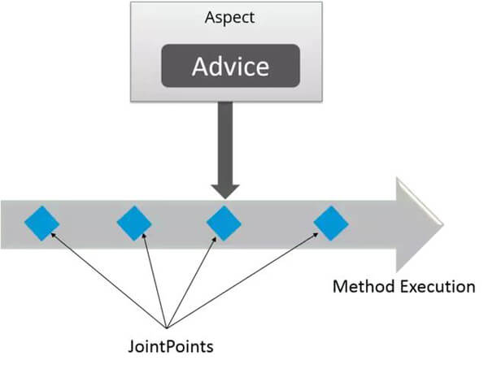

## 什么是 AOP ？


AOP(Aspect-Oriented Programming)，即面向切面编程, 它与 OOP( Object-Oriented Programming, 面向对象编程) 相辅相成， 提供了与 OOP 不同的抽象软件结构的视角。

* 在 OOP 中，以类( Class )作为基本单元
* 在 AOP 中，以切面( Aspect )作为基本单元。

  
## 什么是 Aspect ？
Aspect 由 PointCut 和 Advice 组成。 <br/>
* 它既包含了横切逻辑的定义，也包括了连接点的定义。
* Spring AOP 就是负责实施切面的框架，它将切面所定义的横切逻辑编织到切面所指定的连接点中。

AOP 的工作重心在于如何将增强编织到目标对象的连接点上, 这里包含两个工作:

* 1、如何通过 PointCut 和 Advice 定位到特定的 JoinPoint 上。
* 2、如何在 Advice 中编写切面代码。

*可以简单地认为, 使用 @Aspect 注解的类就是切面*



## 什么是 JoinPoint ?

JoinPoint ，切点，程序运行中的一些时间点, 例如：

* 一个方法的执行。
* 或者是一个异常的处理。

在 Spring AOP 中，JoinPoint 总是方法的执行点。

## 什么是 PointCut ？

PointCut ，<em>匹配</em> JoinPoint 的谓词(a predicate that matches join points)。

````
简单来说，PointCut 是匹配 JoinPoint 的条件。
````
* Advice 是和特定的 PointCut 关联的，并且在 PointCut 相匹配的 JoinPoint 中执行。即 Advice => PointCut => JoinPoint 。
* 在 Spring 中, 所有的方法都可以认为是 JoinPoint ，但是我们并不希望在所有的方法上都添加 Advice 。而 PointCut 的作用，就是提供一组规则(使用 AspectJ PointCut expression language 来描述) 来匹配 JoinPoint ，给满足规则的 JoinPoint 添加 Advice 。

## 关于 JoinPoint 和 PointCut 的区别

JoinPoint 和 PointCut 本质上就是两个不同纬度上的东西。

* 在 Spring AOP 中，所有的方法执行都是 JoinPoint 。而 PointCut 是一个描述信息，它修饰的是 JoinPoint ，通过 PointCut ，我们就可以确定哪些 JoinPoint 可以被织入 Advice 。
* Advice 是在 JoinPoint 上执行的，而 PointCut 规定了哪些 JoinPoint 可以执行哪些 Advice 。

或者，我们在换一种说法：

* 1、首先，Advice 通过 PointCut 查询需要被织入的 JoinPoint 。
* 2、然后，Advice 在查询到 JoinPoint 上执行逻辑。

## 什么是 Advice ？

<em> Advice ，通知。 </em>

* 特定 JoinPoint 处的 Aspect 所采取的动作称为 Advice 。
* Spring AOP 使用一个 Advice 作为拦截器，在 JoinPoint “周围”维护一系列的拦截器。

#### 有哪些类型的 Advice？
````
* Before -前置通知 这些类型的 Advice 在 JoinPoint 方法之前执行，并使用 @Before 注解标记进行配置。
* After Returning -返回通知 这些类型的 Advice 在连接点方法正常执行后执行，并使用 @AfterReturning 注解标记进行配置。
* After Throwing -异常通知 这些类型的 Advice 仅在 JoinPoint 方法通过抛出异常退出并使用 @AfterThrowing 注解标记配置时执行。
* After Finally -后置通知 这些类型的 Advice 在连接点方法之后执行，无论方法退出是正常还是异常返回，并使用 @After 注解标记进行配置。
* Around -环绕通知 这些类型的 Advice 在连接点之前和之后执行，并使用 @Around 注解标记进行配置。
````
## 什么是 Target ？

Target ，织入 Advice 的目标对象。目标对象也被称为 Advised Object 。

* 因为 Spring AOP 使用运行时代理的方式来实现 Aspect ，因此 Advised Object 总是一个代理对象(Proxied Object) 。
* 注意, Advised Object 指的不是原来的对象，而是织入 Advice 后所产生的代理对象。
* Advice + Target Object = Advised Object = Proxy 。

## AOP 有哪些实现方式？
实现 AOP 的技术，主要分为两大类：

* <em>静态代理</em> - 指使用 AOP 框架提供的命令进行编译，从而在编译阶段就可生成 AOP 代理类，因此也称为编译时增强。
````
* 编译时编织（特殊编译器实现）
* 类加载时编织（特殊的类加载器实现）。
````

* <em>动态代理</em> - 在运行时在内存中“临时”生成 AOP 动态代理类，因此也被称为运行时增强。目前 Spring 中使用了两种动态代理库：
````
* JDK 动态代理
* CGLIB
````
那么 Spring 什么时候使用 JDK 动态代理，什么时候使用 CGLIB 呢？

````
// From 《Spring 源码深度解析》P172
// Spring AOP 部分使用 JDK 动态代理或者 CGLIB 来为目标对象创建代理。（建议尽量使用 JDK 的动态代理）
// 如果被代理的目标对象实现了至少一个接口，则会使用 JDK 动态代理。所有该目标类型实现的接口都讲被代理。
// 若该目标对象没有实现任何接口，则创建一个 CGLIB 代理。
// 如果你希望强制使用 CGLIB 代理，（例如希望代理目标对象的所有方法，而不只是实现自接口的方法）那也可以。但是需要考虑以下两个方法：
//      1> 无法通知(advise) Final 方法，因为它们不能被覆盖。
//      2> 你需要将 CGLIB 二进制发型包放在 classpath 下面。
// 为什么 Spring 默认使用 JDK 的动态代理呢？笔者猜测原因如下：
//      1> 使用 JDK 原生支持，减少三方依赖
//      2> JDK8 开始后，JDK 代理的性能差距 CGLIB 的性能不会太多。可参见：https://www.cnblogs.com/haiq/p/4304615.html

````

<em>Summary：</em>

Spring AOP 中的动态代理主要有两种方式，

* JDK 动态代理

JDK 动态代理通过反射来接收被代理的类，并且要求被代理的类必须实现一个接口。JDK动态代理的核心是 InvocationHandler 接口和 Proxy 类。

* CGLIB 动态代理

如果目标类没有实现接口，那么 Spring AOP 会选择使用 CGLIB 来动态代理目标类。

当然，Spring 也支持配置，强制使用 CGLIB 动态代理。

CGLIB（Code Generation Library），是一个代码生成的类库，可以在运行时动态的生成某个类的子类，注意，CGLIB 是通过继承的方式做的动态代理，因此如果某个类被标记为 final ，那么它是无法使用 CGLIB 做动态代理的。